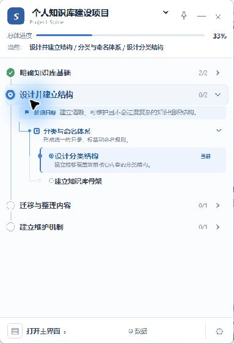
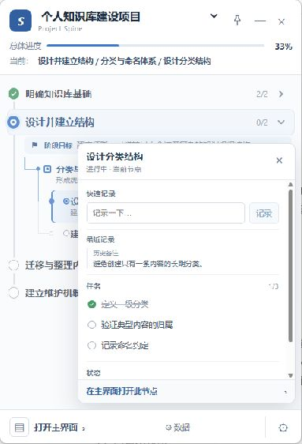
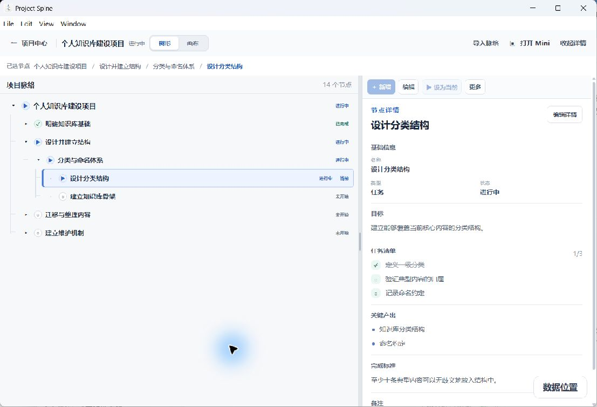
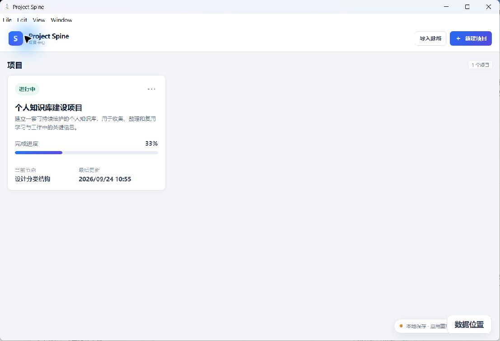
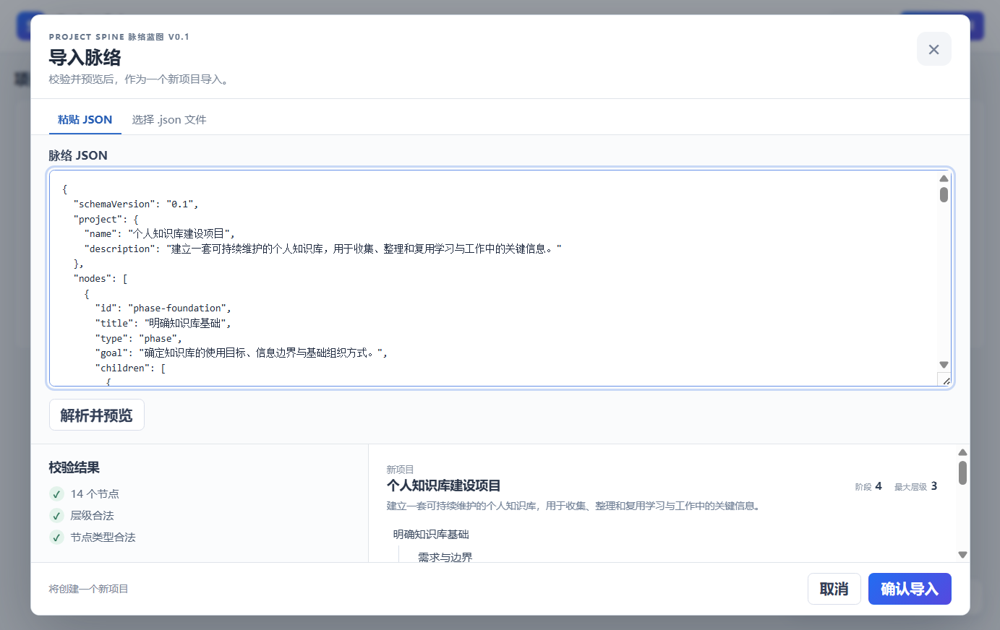

# Project Spine

**帮助长期项目保持结构、上下文与执行脉络的 Windows 桌面工具。**

Project Spine 不是另一张不断变长的待办清单。它把长期项目组织成可理解的脉络，让你随时看清当前在哪里、为什么在做这件事、下一步是什么，以及什么才算完成。

当前公开版本：**v0.2.0-rc.1 · Pre-release / Release Candidate**

[下载 Windows 安装包](https://github.com/vmn115632-cell/Project-Spine/releases/download/v0.2.0-rc.1/Project-Spine-Setup-0.2.0-rc.1.exe) · [查看 Release](https://github.com/vmn115632-cell/Project-Spine/releases/tag/v0.2.0-rc.1)

SHA-256：`44C904089913C52FBB4351B80168C43C75DA66C18CE46C892887DBDCE0594973`



## 为什么需要 Project Spine

长期项目的问题通常不是没有任务，而是随着时间推移逐渐失去：

- 当前在哪里；
- 为什么做这件事；
- 下一步是什么；
- 什么才算完成。

聊天、文档和零散待办可以保存信息，却很难持续呈现项目的阶段、结构、决策和当前位置。Project Spine 让全局脉络与当前执行位置同时可见，帮助你在中断之后快速恢复工作现场。

## 核心能力

Project Spine 使用一条清晰的结构组织项目：

```text
Project
└── Phase
    └── Module
        ├── Task
        └── Decision
```

其中 **Current Node** 标记当前真正需要推进的位置。项目结构、节点目标、任务清单、关键产出、完成标准和备注共同构成可持续维护的执行上下文。

## Mini Workspace

V0.2 默认以 Mini 作为日常工作入口。它保留最需要持续关注的信息，同时避免把完整主界面一直占在桌面上。

- 查看当前项目、总体进度和项目主脉络；
- 在多个项目之间快速切换；
- 快速更新 Task 状态；
- 查看并追加 Quick Note；
- 置顶、最小化或关闭 Mini；
- 随时切换到 Main 进行深度编辑。




## Main Workspace

Main 负责完整项目维护：查看和调整项目结构，编辑 Node Detail，在树形视图与 Canvas 之间切换，以及导入 Blueprint。



项目中心集中展示项目进度、当前节点和最近更新时间。



## AI Blueprint Generation

Project Spine 支持让 AI 根据正式规范生成可导入的项目 Blueprint：

```text
用户项目需求
↓
AI 读取 Project Spine Blueprint Specification
↓
生成 Blueprint JSON
↓
Project Spine 校验 / 预览
↓
导入项目
↓
开始执行
```

Blueprint Schema 在 V0.2 中仍为 **0.1**。

1. 阅读 [AI Blueprint 模板说明](templates/README.md)；
2. 将 [AI Blueprint 生成规范](templates/Project_Spine_AI_Blueprint_Generation_Specification_V0.1.md) 与项目需求交给 AI；
3. 使用 [Blueprint JSON 模板](templates/Blueprint_Template_V0.1.json) 生成合法 JSON；
4. 参考 [公开示例 Blueprint](templates/examples/Example_Project_Blueprint.json)；
5. 在 Project Spine 中校验、预览并导入。

AI 可以协助拆解项目结构，项目边界、节点状态和当前执行位置仍应由用户确认。



## What's New in V0.2

1. Mini 成为默认工作入口；
2. Mini 项目快速切换；
3. Task 状态快速更新；
4. Mini 窗口控制与生命周期优化；
5. 项目删除；
6. 自定义软件安装位置；
7. 自定义业务数据位置；
8. 数据目录迁移；
9. 针对较大项目优化状态更新与界面渲染，显著减少 Mini 操作时的卡顿；
10. 改善 Windows 窗口恢复与稳定性。

## Download

- 版本：`v0.2.0-rc.1`
- 平台：Windows x64
- 状态：Pre-release / Release Candidate
- 文件：`Project-Spine-Setup-0.2.0-rc.1.exe`
- 大小：`123,360,429 bytes`
- SHA-256：`44C904089913C52FBB4351B80168C43C75DA66C18CE46C892887DBDCE0594973`

[下载 Project Spine v0.2.0-rc.1](https://github.com/vmn115632-cell/Project-Spine/releases/download/v0.2.0-rc.1/Project-Spine-Setup-0.2.0-rc.1.exe)

当前 Installer 尚未进行代码签名，Windows SmartScreen 可能显示安全提示。请只从本仓库的正式 Releases 页面下载，并在安装前核对版本、文件名和 SHA-256。

## 文档

- [V0.2 产品概览](docs/PRODUCT_OVERVIEW_PUBLIC_V0.2.md)
- [V0.2 Release Notes](docs/RELEASE_NOTES_PUBLIC_V0.2.md)
- [V0.2 Known Issues](docs/KNOWN_ISSUES_PUBLIC_V0.2.md)
- [安装说明](docs/INSTALL_GUIDE.md)
- [下载说明](release/DOWNLOAD_INFO.md)
- [V0.1 历史 Release Notes](docs/RELEASE_NOTES_PUBLIC_V0.1.md)

## 仓库说明

这是 Project Spine 的公开产品展示仓库，包含产品介绍、公开截图、安装说明、Release Notes、Known Issues 和 AI Blueprint 模板。

**本仓库不包含 Project Spine 源码。**
