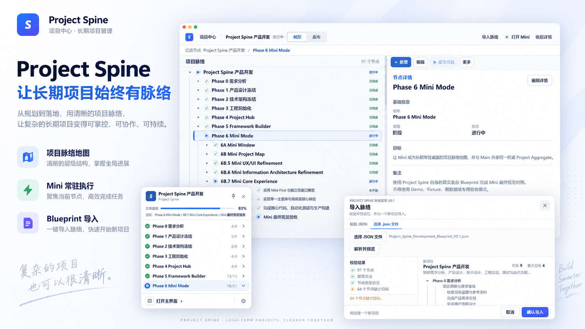
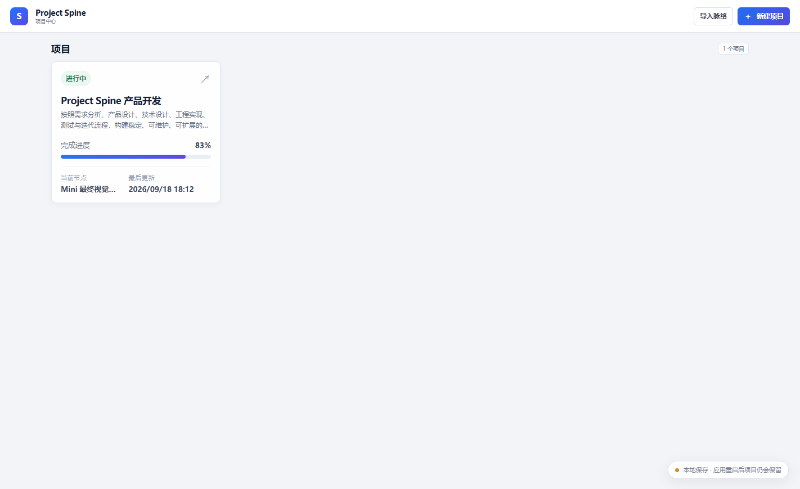
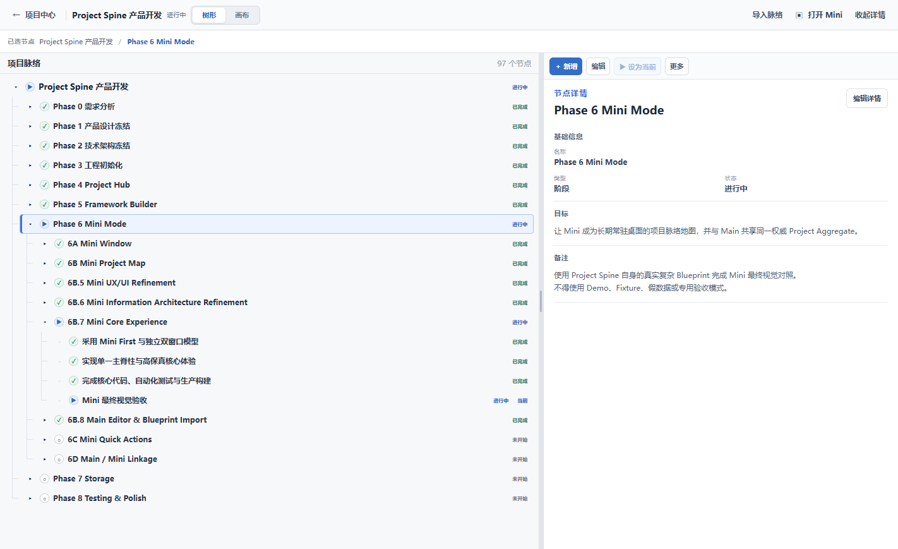
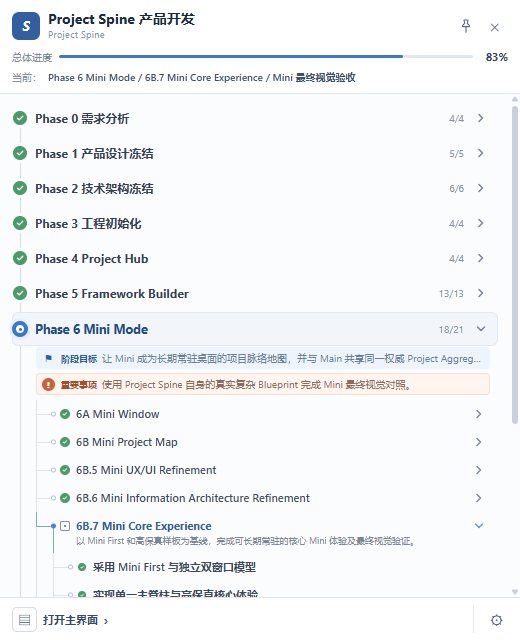
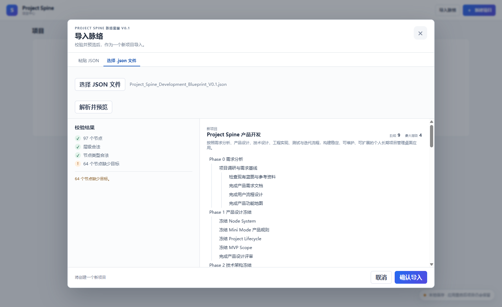
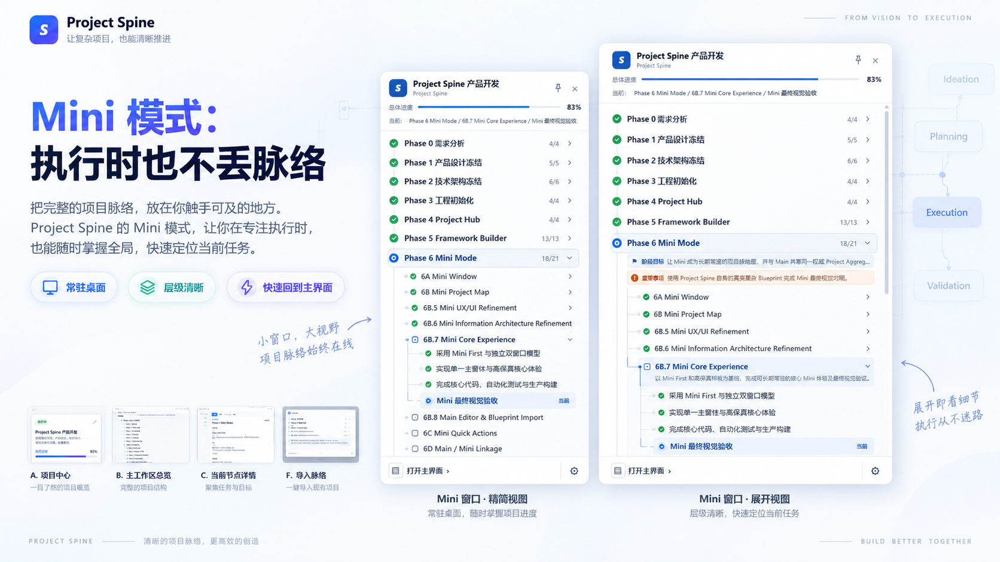
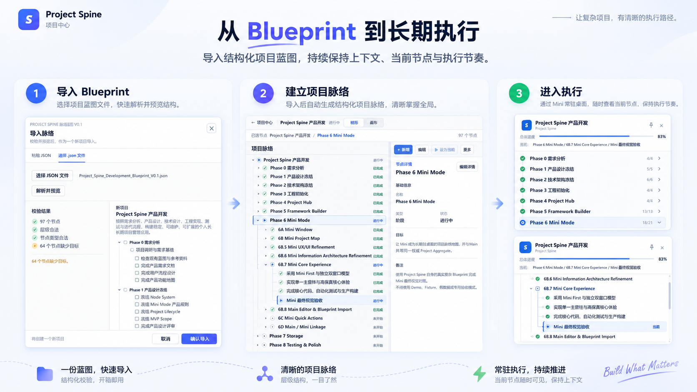

# Project Spine

**一个面向长期复杂项目的项目脉络管理工具。**

Project Spine 不是普通的 Todo 工具。它关注长期项目中的整体结构、当前节点和执行上下文，让用户在项目不断演化、工作多次中断后，仍能快速找回全局与当前位置。主界面负责结构编辑和整体查看，Mini 模式负责执行过程中的持续可见。

_从项目全貌到当前节点，把长期项目放回清晰、可持续的结构中。_

## Project Spine 解决什么问题

长期项目往往不是缺少任务，而是逐渐失去脉络：

- 聊天记录越积越多，最初的目标和约束散落在不同上下文中；
- 文档不断变长，打开和维护它的成本越来越高；
- 日常执行容易占据注意力，项目当前处于哪个阶段反而变得模糊；
- 传统待办工具可以记录任务，却不擅长保留阶段、分支、决策和上下层关系。

Project Spine 的目标，是让项目结构、当前阶段、当前路径和关键节点始终保持可见，让规划、执行和恢复工作现场形成连续过程。

## 核心能力

- **项目中心**：查看项目、完成进度、当前节点和最近更新时间。
- **项目脉络树**：用阶段、模块、任务和决策表达长期项目结构。
- **节点详情**：记录目标、任务清单、关键产出、完成标准和备注。
- **Blueprint 导入**：校验并预览结构化 JSON，一次建立项目骨架。
- **Mini 模式**：在执行过程中让项目主脉络和当前位置常驻桌面。
- **Mini Quick Actions**：在 Mini 中处理任务清单、状态和简短备注。
- **Main / Mini 联动**：两个界面共享同一份项目数据，并保持选择和执行状态同步。
- **SQLite 持久化**：保存项目数据、备份与恢复信息，以及常用界面状态。

## 界面预览

以下图片均来自 Project Spine 正式软件的实际运行界面。

### 项目中心

_集中查看项目进度、当前节点和最近更新时间。_

### 主工作区

_在同一界面中查看项目脉络，并维护节点详情。_

### Mini 项目脉络

_保留阶段主脊柱、当前路径和正在执行的节点。_

### Blueprint 导入

_导入前完成结构校验和预览，再创建正式项目。_

## Mini 模式

Mini 是为长期执行准备的常驻项目脉络窗口。它不会把主界面简单缩小，而是保留最需要持续关注的信息：项目进度、阶段主线、当前路径和当前节点。

用户无需频繁切回主界面，也能知道项目正处于哪个阶段、当前工作与上层结构如何连接。需要维护完整结构和详细内容时回到 Main；进入专注执行后，让 Mini 留在桌面侧边。

## 从 Blueprint 到长期执行

Project Spine 将项目从初始结构带入持续执行：

1. 导入并校验 Blueprint；
2. 建立阶段清晰的项目脉络；
3. 设置唯一的当前节点；
4. 在 Main 中编辑结构和节点详情；
5. 在 Mini 中持续查看并推进当前工作；
6. 关闭和重新启动后，恢复项目数据与工作现场。

## 当前版本

当前公开候选版本为 **v0.1.0-rc.1**，面向 Windows x64。

该版本已经具备可安装、可导入、可持久化和可用于真实长期项目的基础能力。目前仍有少量非阻塞限制，包括未签名的 Windows 安装包，以及大型项目在 Canvas 初始总览时文字较小。

- [查看 Release Notes](docs/RELEASE_NOTES_PUBLIC_V0.1.md)
- [查看已知问题](docs/KNOWN_ISSUES_PUBLIC_V0.1.md)

## 安装与下载

Project Spine 当前提供 Windows x64 版本，安装包将通过本仓库的 **Releases** 页面发布。

当前安装包未进行 Authenticode 代码签名，Windows SmartScreen 可能显示“未知发布者”或要求额外确认。首次安装前，请确认文件来自本仓库的正式 Releases 页面，并阅读安装说明。

- [安装说明](docs/INSTALL_GUIDE.md)
- [下载说明](release/DOWNLOAD_INFO.md)

## 仓库说明

这是 Project Spine 的公开产品展示仓库，包含：

- 产品介绍；
- 宣传图与真实软件截图；
- 安装和下载说明；
- Release Notes；
- Known Issues。

**本仓库不包含 Project Spine 源码，源码未公开上传。**

## 相关文档

- [产品概览](docs/PRODUCT_OVERVIEW_PUBLIC_V0.1.md)
- [安装说明](docs/INSTALL_GUIDE.md)
- [Release Notes](docs/RELEASE_NOTES_PUBLIC_V0.1.md)
- [Known Issues](docs/KNOWN_ISSUES_PUBLIC_V0.1.md)
- [下载说明](release/DOWNLOAD_INFO.md)

## 说明

Project Spine 当前是一个面向个人长期复杂项目的 Windows 桌面应用。后续工作将继续聚焦真实使用中的清晰度、稳定性和长期执行体验。
